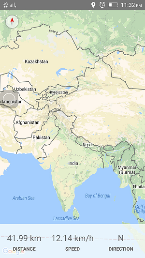

# react-native-maps
React Native Maps for iOS  and Android

# react-native-maps-example

This repository contains a React Native project, implementing the [react-native-maps](https://github.com/react-community/react-native-maps) package.

## Installation

### Development

1. Clone this repo.
2. Run `npm install`.
3. Ensure a device, or emulated Android image is connected (`adb devices`).
4. Run `react-native run-android`.
     or
5. Run 'react-native run-ios'.

#### get more detail from [react-native-maps](https://github.com/react-community/react-native-maps).

